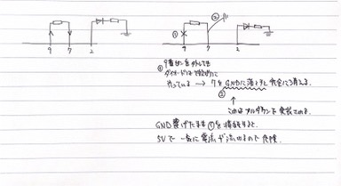

# setup

```shell
pio init --board=uno
```

# プルアップ／プルダウン

マイコンと電源の間にスイッチを接続した場合、スイッチを入れている間には電圧が印加されているので問題はないが、
スイッチを切った場合は「浮いている状態」になる。この状態（スイッチを切って開放状態）ではノイズやマイコンの誤作動
が誘発される可能性があるため問題となる。

CPUやマイコンが回路から情報を読み出すときには電圧情報を基準とするが、浮いている場合はHighかLowかはっきりしないため、
動作が不安定（ONなのかOFFなのか判断できない）となってしまうため。そこで、入力レベルがVCCレベルであることを明確にするために
プルアップ抵抗を使用することができる。

## プルダウン

（１）あるピンに5V印加したいので直列で接続。しかしスイッチがOFFのときには「浮いてしまう」
（２）OFFのときに0VとなるようにGNDにも接続。しかし、スイッチがONの時に一気にGNDに電流が流れて（ショート）危険
（３）スイッチとGNDの間に大きな抵抗を挟むことで、スイッチがONでも電流が流れないようにする。

ピンを正しく0Vと接続することをプルダウンという。まとめると、GNDと接続してもショートしないように間に抵抗を挟んでいるだけ。


# digitalRead/Write

ピンの入出力を定義する前に、`pinMode()` で INPUT/OUTPUT を定義しておく必要がある。
設定し忘れた時に思っていた挙動にならなかった（LEDが暗くしか光らなかった）ことがあるので、動作が未定義になるのだと推察。

ピンに書き込むための関数。第一引数にピン番号、第二引数に状態を指定する。


```cpp
val = digitalWrite(LED, HIGH);
```

ピンの状態を読み出すための関数。

```cpp
val = digitalRead(BUTTON);
```

ここで `BUTTON` はいま7番ピンに接続しているので、そこの電圧の情報を読み取る。
Highなら1、Lowなら0を返す。


# タクトスイッチ

ピンは `pinMode()` を使うことで、入力 or 出力として定義できる。入力にした場合、センサの状態を検知でき、出力に設定した場合
接続されているものの制御を行うことができる。

```cpp
const int LED = 13;
pinMode(LED, OUTPUT);
```
ピン番号13を出力に定義したので、例えば `digitalWrite(LED, HIGH)` で信号をHIGHにすることができる。
# PWM について

パルス幅変調（Pulse Width Modulation）を用いることで、LEDなどのオンオフをより高度に制御することができる。
Arduino のPWM出力は3, 5, 6, 9, 10, 11 に割り当てられている。
PWMの出力は `analogWrite` 関数で定義できる。


```cpp
analogWrite(pin_number, idx);
```

どのピン番号から出力するかを定義する。0〜255の256段階を引数に取って、例えば186を書き込むとPWMは50%を意味する。ただし、高速に書き込まれるため（高速にループ関数が回るため）、`delay` を入れないと高速に点滅してしまうことに留意。


# Lチカ

## (1)

ピンから出力して（`digitalWrite`で5Vの出力）それを読み（`digitalRead`）、それをフラグとしてLチカをする。完全に9ピンを抜いても、LEDは（少し暗くなったが）光っていた。浮いているときに確実にGNDに落とすためにプルダウン抵抗が必要なのだと分かった。




## (2)

スイッチを押すと点灯して、もう一度押すと消灯するような、スイッチのON, OFF でLチカを切り替える回路を組む。

### 症状（１）：押すと一瞬ついてすぐ消えてしまう

一度押すと31行目が処理されて、高速でループが回っているので、次のループで36行目が処理される。このときにボタンはまだ押されているままなので LOW が書き込まれて消灯してしまうのだと思う。その証拠に、ボタンを押しっぱなしにすると、LEDが点滅する挙動を示している（高速で31と36行目が処理され続けているのだと推察）。

```cpp
 29     val = digitalRead(7);
 30 
 31     if ((state==0)&&(val==HIGH)){
 32         digitalWrite(2, HIGH);
 33         delay(100);
 34         state = 1;
 35     }
 36     else if ((state==1)&&(val==HIGH)){
 37         digitalWrite(2, LOW);
 38         delay(100);
 39         state = 0;
 40     }
 41 }
```


### 症状（２）：押しているときだけ点灯

```cpp
 29     curr_val = digitalRead(7);
 30 
 31     if ((prev_val==0)&&(curr_val==1)){
 32         digitalWrite(2, HIGH);
 33         delay(100);
 34     }
 35 
 36     if ((prev_val==1)&&(curr_val==0)){
 37         digitalWrite(2, LOW);
 38         delay(100);
 39     }
 40 
 41     prev_val = curr_val;
```

### （３）fix ver.

スイッチを押すということは、そのタイミングでLOW-->HIGHに変化するということであり、それをまずは検知する。そのときに `bool` のフラグではなく、`a = 1 -a;` という形式を用いることで、0と1の変換を一行で実装するのが肝であった。こうすることでスイッチによって HIGH/LOW が切り替わった時に、フラグも反転するように実装することができる。

以下の例では正しく、一回押して点灯し続けることができている。

```cpp
 28     curr_val = digitalRead(7);
 29 
 30     if((prev_val==LOW)&&(curr_val==HIGH)){
 31         switch_state = 1 - switch_state;
 32     }
 33     prev_val = curr_val;
 34 
 35     if (switch_state==HIGH){
 36         digitalWrite(2, HIGH);
 37     } else {
 38         digitalWrite(2, LOW);
 39     }
 40 }
```


## （３）

押すと輝度が何段階に変わるようにしたい。ここでの留意点はまず、PWMを出力できるのが「〜」のついているピンからであること。その他のピンで `analogWrite`をしても、一切輝度は変えられず（エラーにはならずただ256の値が書き込まれるような挙動）、HIGHかLOWかしか出力できなかった。

スイッチのON/OFF は先程の、previous と current の比較を流用している。


```cpp
30     curr_val = digitalRead(7);
31 
32     if((prev_val==LOW)&&(curr_val==HIGH)){
33 
34         brightness = 255 - 64 * pattern;
35 
36         pattern++;
37         if(pattern>4) pattern=0;
38 
39     }
40     prev_val = curr_val;
41 
42     analogWrite(3, brightness);
43 }

// しかしなぜかゼロ輝度にはならず、、、
```

